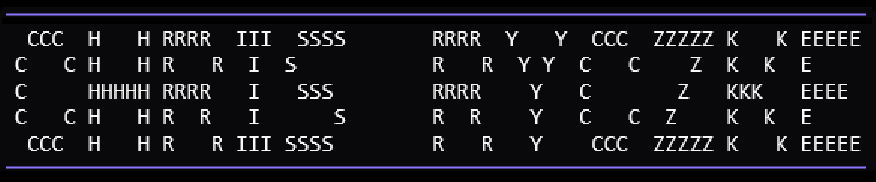

    

Hello! If you're here, that means you're viewing the source code of my portfolio.

## Website
The website is hosted under https://www.chrisryczke.com, where you can view the front-end side of my portfolio.

## Code
To see the home page, view [index.js](https://github.com/SnowmanSixtyFour/chrisryczke.github.io/blob/main/js/index.js).

For the rest of the files, view all of the [scripts](https://github.com/SnowmanSixtyFour/chrisryczke.github.io/tree/main/js).

### Special Thanks
BigBlue Terminal Font - [VileR](https://int10h.org/blog/2015/12/bigblue-terminal-oldschool-fixed-width-font/)

# Copyright
Copyright (c) 2026 Snowman64, under the [GNU General Public License v3.0](https://www.gnu.org/licenses/gpl-3.0.en.html).